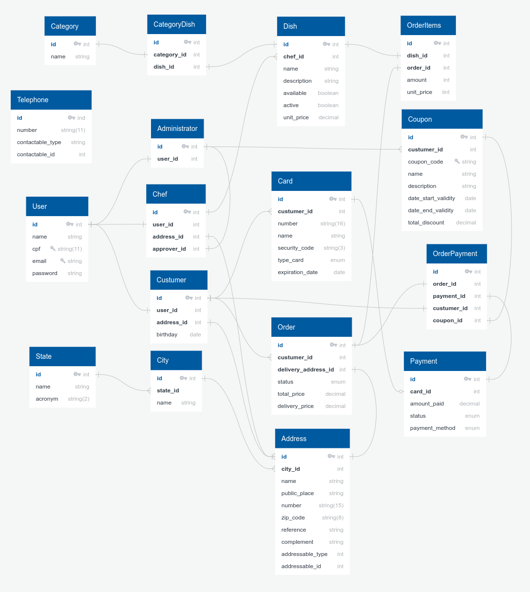

# Modelagem de Banco de Dados - Raro Food

Projeto de modelagem de banco de dados da aplicação Raro Food. Foi iniciado durante a semana 8 da turma de Ruby on Rails - Raro Academy pelo professor Guilherme Andrade e continuado como exercício da semana citada, que teve "Active Record" como tema.

## Objetivos

Tendo como base o [enunciado do exercício](./.gitlab/enunciado.md), os objetivos são:

- [x] Estruturar corretamente as migrations: nomenclatura, timestamps, etc;
- [x] Sequenciar as migrations corretamente;
- [x] Utilizar modificadores para as colunas definidas nas migrations;
- [x] Utilizar corretamente as referências para outras tabelas;
- [x] Adicionar/atualizar as associações nos models, acrescentando as opções que for julgadas necessárias;
- [x] Documentação das tomadas de decisão.

## Tomadas de decisão

No próprio enunciado da atividade há uma sugestão de passos para o desenvolvimento do exercício, por isso os primeiros passos dados foram:

1. Transformar o Diagrama ER para o Modelo Lógico Relacional, aplicando as regras vistas em aula.

   - Foi criado utilizando o site [QuickDBD](https://www.quickdatabasediagrams.com/) e o resultado está abaixo, mas pode ser conferido também diretamente na plataforma utilizada, através desse [link](https://app.quickdatabasediagrams.com/#/d/yYrO0N).

   <p align="center">
      
   </p>

2. Identifique chaves primárias, estrangeiras e outras colunas que possam existir.

   Nesse ponto foi identificado:

   - **Necessidade de criação de novas tabelas**: Coupon, Card, Payment e Order Payment. Essa última como uma tabela _pivot_ para agregar as chaves de Order, Payment, Costumer e Coupon. Os models para Coupon, Card e Order Payment foram criados com suas respectivas referencias, já o Payment foi criado como model e a sua migration foi editada manualmente.
     <br>

   ```bash
   rails g model Coupon administrator:references coupon_code:string name:string description:string date_start_validity:date date_end_validity:date total_discount:'decimal{8,2}'

   rails g model Card customer:references number nome security_code type_card expiration_date:date

   rails generate model order_payment customer:references payment:references coupon:references order:references
   ```

   - **Coluna faltante**: estava faltando a coluna referente ao atributo "Valor do Frete" na tabela Order. Ela foi adicionada utilizando o comando `add_column :orders, :delivery_price, :decimal, precision: 8, scale: 2, default: 0, after: :delivery_address_id`.
     <br>

3. Identifique os tipos de dados, constraints para cada coluna e os relacionamentos entre as tabelas.

   Seguindo esse passo foi possível:

   - Identificar que em algumas colunas das novas tabelas criadas seria necessário implementar o tipo de dado _enumeration_, são elas: _status_ e _payment_method_ da tabela Payment; _status_ da tabela Order e _type_card_. Essa última foi criada inicialmente da forma errada, por isso foi realiza uma migration posterior para a correção: `rails g migration ChangeDataTypeForCardTypeCard`.
     <br>

   - Identificar que alguns relacionamentos poderiam ser adicionados nas tabelas que já existiam:
     -> Na tabela Administrator foram notadas as associações com Chefs, Telephones e Coupons. Na relação com Coupons, foi avaliado implementar um modificador para Administrator, da mesma forma que existe com Chef (_approver_), porém a ideia foi descartada, pois corria o risco de deixar a associação confusa;
     -> Na tabela User foram adicionadas os modificadores a nível de associação com as tabelas Administrator, Chef e Customer;
     -> Na tabela Address foi adicionada as relações com City e com Order.
     <br>

   - Perceber que ficou faltando uma _constraint_ na tabela Coupon. Por isso, foi criada uma nova migration com a seguinte notação: `add_index :coupons, :coupon_code, unique: true`. Dessa forma, fica definido que o código do cupom de desconto não pode se repetir.

## Informações gerais

- MODIFICADORES DE MIGRATION: Para as novas migrations criadas foi seguido o padrão utilizado para o tipo de dado string, como `null: false` e `limit: 255`, exceto para Cards que teve seus _limits_ definidos de acordo com a quantidade padrão de número de cartão de código de segurança.

- SETUP AMBIENTE: Houve dificuldade para realizar a conexão com o MySQL, foi necessário realizar algumas pesquisas para conseguir configurar corretamente, porém um erro de conexão permanecia. Realizei algumas tentativas, como reinstalar o driver, mas a única solução encontrada foi retirar do arquivo `database.yml` a seguinte configuração que estava no escopo de _default_: `socket: /tmp/mysql.sock`.

## Instalação

Antes de iniciar a aplicação, recomenda-se a execução da seguinte sequência de comandos:

```bash
rvm use 3.1.2
cd raro-food
bundle install
rails db:create
rails db:migrate
rails db:seed
```

Para iniciar o servidor, recomenda-se a utilização do comando `./bin/dev`, pois ele garante os assets serão todos devidamente processados.
